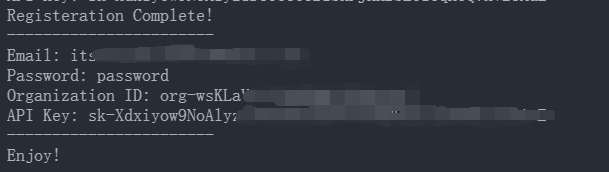

# 12/20/2020 openAI已经加了reCHAPTCHA验证，此脚本已无法使用。

# (半)自动注册openAI账号并获取API key脚本

## 1. 使用方法

### 1.1. 获取sms-active API

在[smsActiveAPI](https://sms-activate.org/en/api2)网站中点击生成API key，然后将生成的API key写入windows的环境变量中

> 请保证你的sms-active账号中余额充足(一个账号约10.5卢布)

### 1.2. 更改代理

请修改`main.py`中的`PROXIES`变量，将其更改为你的代理(OpenAI在大陆地区需要使用代理才能注册)

### 1.3. 填写GMAIL账号

请修改`main.py`中的`GMAIL`变量，将其更改为你的GMAIL账号。此账号将用来接收验证邮件，请确保邮箱可用。

### 1.4. 运行脚本

运行`main.py`，将提示`Do you want to buy a number? (Y/N)`，输入`Y`，则将自动购买一个号码；输入`N`，可以输入已购买但是未使用的号码（仅支持印度号码，无需填91区号）。稍等片刻后将提示`Waiting for email verification...Enter Y to continue`，此时请打开你的GMAIL邮箱，点击邮件中的链接，完成邮箱验证。然后输入`Y`，程序将自动完成注册，并返回API key。

## 2. 注意事项

### 2.1. 关于无法接收到验证码

sms-active的号码最近比较不靠谱，不一定可以接收得到验证码。如果等待很久(如5分钟以上)仍未接收到验证码，可以去sms-active网站上取消购买此号码，费用会立即退回到你的账号中。然后重新运行脚本再尝试即可

### 2.2. 关于Edge模拟登陆

此脚本大多数步骤都是直接发包交互的，但是登陆那一步使用了Seleniumn + Edge模拟登陆，因为openAI登陆时有多步token验证，并且是调用的js脚本，发包比较麻烦。如果提示Edge版本不正确可以到[这里](https://developer.microsoft.com/en-us/microsoft-edge/tools/webdriver/)下载对应版本的Edge驱动，然后将其放到此脚本所在目录下即可。
